# News Insight — Technical Guide

**An MLOps platform for Tunisian news analysis**

> A complete engineering walkthrough: architecture, data pipeline, machine learning, generative AI, and the MLOps practices that keep it running.

| | |
|---|---|
| **Project** | News Insight (in-app brand: *Tuniscope*) |
| **Domain** | Data Science & AI · MLOps · NLP |
| **Stack** | Python · PostgreSQL + pgvector · Hugging Face · BERTopic · Prefect · MLflow · FastAPI · React · Docker |
| **Audience** | Engineers, data scientists, and reviewers who want to understand *how* and *why* the system works |
| **Reading time** | ~45 minutes end to end; each chapter is self-contained |

---

## Executive summary

Tunisian online news is **abundant but fragmented**. Outlets such as *La Presse*, *Business News*, *Kapitalis*, and *Mosaïque FM* publish independently, mix French and Arabic, and share no common index. A reader cannot search the day's news *by meaning*, see its overall *mood*, know which *regions* it covers, or simply *ask a question* and get a sourced answer.

**News Insight** closes that gap with a single automated pipeline built on three verbs: **collect → understand → explore**. It scrapes multiple sources on a schedule, enriches every article with embeddings, sentiment, topics, and region tags, layers generative-AI features (summaries and a source-citing chat assistant) on top, and serves everything through a web dashboard. Crucially, it is not a one-off notebook: the pipeline is **orchestrated, tracked, monitored, and reproducible** — an *MLOps* system, not just an ML model.

!!! insight "💡 Key insight"
    The hard part of this project is not any single model. It is turning a pile of models into a **system that runs itself, records what it did, and can be rebuilt from scratch with one command.** That is the difference between "an ML project" and "an MLOps platform."

### The platform at a glance

| Dimension | What it does | Key technology |
|---|---|---|
| **Collect** | Pulls new articles from 4 sources, skips duplicates | RSS + HTML scrapers, `feedparser`, BeautifulSoup |
| **Store** | One table for text *and* vectors | PostgreSQL + pgvector |
| **Understand** | Meaning, mood, topic, region per article | `multilingual-e5-small`, XLM-RoBERTa, BERTopic, gazetteer |
| **Generate** | Summaries, topic names, RAG chat with citations | OpenAI-compatible LLM (Groq) |
| **Explore** | Feed, dashboard, map, semantic search, chat | React + Vite, recharts, d3-geo |
| **Operate** | Scheduled, tracked, monitored, reproducible | Prefect, MLflow, `pipeline_metrics`, Docker |

### What this guide delivers

- A **top-down mental model** of the system, then a **bottom-up** tour of each subsystem.
- Every technical term **defined in plain language before** the detail.
- **Diagrams, comparison tables, and callouts** instead of long paragraphs.
- Per-chapter **learning aids**: key points, common mistakes, a practical example, interview questions, and advanced notes.

---

## How to read this guide

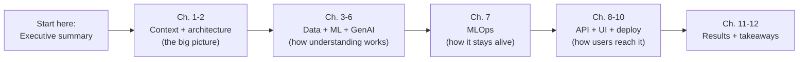

| If you are a… | Read | Skip to |
|---|---|---|
| **Reviewer / jury** | Executive summary, Ch. 2, Ch. 11–12 | Architecture + contributions |
| **Data scientist** | Ch. 4–6 | Storage, ML/NLP, RAG |
| **Platform / MLOps engineer** | Ch. 2, 7, 10 | Architecture, orchestration, deployment |
| **Frontend / API developer** | Ch. 8–9 | API + UI |

---

# 1. Introduction & context

## 1.1 The problem

Digital news in Tunisia is a paradox: **plenty of content, almost no structure.**

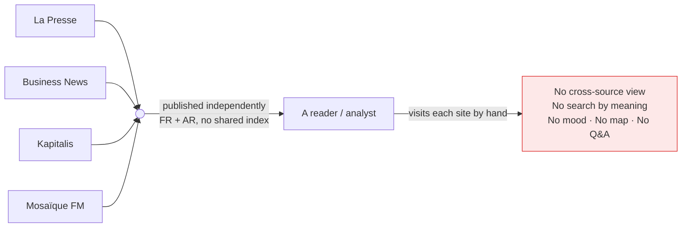

The concrete gaps:

| Gap | Consequence |
|---|---|
| No shared index | You must open every site separately to follow a story |
| Bilingual (FR/AR) | Keyword search misses articles that use different words |
| No metadata | Nothing tells you an article's topic, mood, or region |
| No question interface | You cannot ask "what happened in Sfax this week?" and get an answer |

## 1.2 Why it matters

> "Information is only useful when it can be *found, compared, and questioned*. A feed you cannot query is just noise at scale."

For a journalist, analyst, or citizen, the value is not *more* articles — it is **the ability to see patterns**: how sentiment shifts, which topics dominate, where events cluster geographically. That requires a system that reads every article the way a human would, but at machine scale.

## 1.3 Objectives

The project set four goals, each answered by a later chapter:

- [ ] **O1 — Automated collection** from several Tunisian sources, no manual step *(Ch. 3)*
- [ ] **O2 — NLP enrichment**: embeddings, sentiment, unsupervised topics, region *(Ch. 5)*
- [ ] **O3 — Generative access**: summaries, topic labels, a retrieval-augmented assistant *(Ch. 6)*
- [ ] **O4 — Reproducible MLOps**: orchestration, tracking, monitoring, one-command deploy *(Ch. 7, 10)*

!!! note "📌 Scope note"
    News Insight is an **end-of-semester project**, not a commercial product. The engineering is real and runs today, but the corpus is modest and some features (a permanent scheduler, Arabic-dialect handling) are deliberately left as future work. This guide is honest about those limits.

---

# 2. System architecture

## 2.1 The one-sentence model

> **A layered pipeline turns live news sites into a searchable, answerable web app** — sources flow into one database, get enriched by a bank of models, and are served through an API to a dashboard.

## 2.2 The big picture

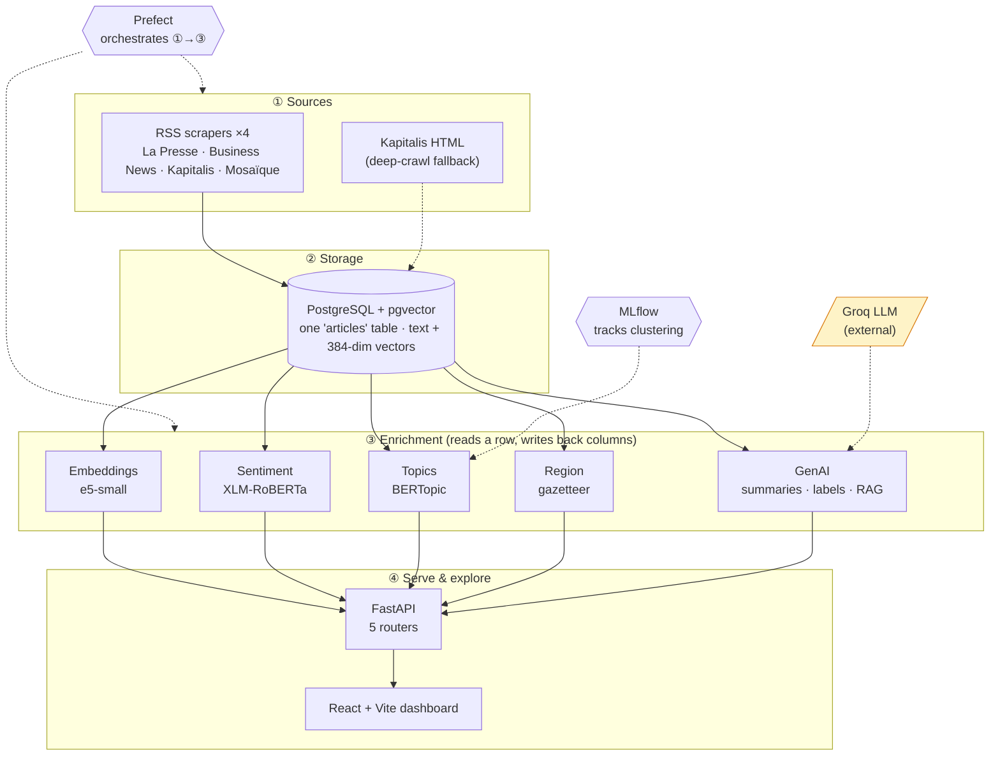

**Legend:** solid arrows = data flow · dashed = orchestration / tracking / external service.

## 2.3 The layers explained

| # | Layer | Responsibility | "Why here?" |
|---|---|---|---|
| ① | **Sources** | Fetch raw articles | Isolates the messy outside world behind a uniform `Article` contract |
| ② | **Storage** | One row per article, text + vector together | A single source of truth; no sync between a metadata DB and a vector DB |
| ③ | **Enrichment** | Add meaning/mood/topic/region as *columns* | Each model is independent and idempotent; re-running is safe |
| ④ | **Serve** | Expose data over HTTP; render a UI | Clean separation of compute (pipeline) from access (API/UI) |

## 2.4 The design principles that shaped it

!!! success "✅ Best practice — one table, columns not services"
    Enrichment results are **columns on the article row**, not separate microservices or tables. Adding sentiment is "write a column"; recomputing is "overwrite a column." This keeps the data model flat, the joins non-existent, and re-runs trivially safe.

!!! success "✅ Best practice — idempotency everywhere"
    Every write is an **upsert** (`INSERT … ON CONFLICT (url) DO UPDATE`). Running the pipeline twice produces the same result as running it once. This is what makes a scheduled, retrying pipeline safe.

### Trade-offs the architecture accepts

| Decision | Benefit | Cost / limit |
|---|---|---|
| pgvector inside Postgres | One database, no extra infra | Won't scale to billions of vectors like a dedicated ANN store |
| Enrichment as columns | Simple, flat, idempotent | A very wide table if signals keep growing |
| Synchronous per-article models | Easy to reason about | Slower than batched GPU inference |
| Monolithic compose stack | One-command deploy | Not horizontally scalable as-is |

> ### 📌 Key points
> - The system is **four layers**: sources → storage → enrichment → serve.
> - The database is the **hub**; everything reads from and writes to one `articles` table.
> - **Prefect** drives the pipeline; **MLflow** watches the ML; **Groq** is the only external dependency.
> - The two load-bearing principles are **"columns not services"** and **idempotency (upsert)**.

> ### ⚠️ Common mistakes
> - **Treating the vector store as separate** from the metadata store — then fighting to keep them in sync. News Insight avoids this by putting the vector *in the row*.
> - **Non-idempotent writes** — inserting instead of upserting, so a re-run creates duplicates and a retry corrupts state.

> ### 🛠️ Practical example
> A new article arrives from La Presse. It is upserted into `articles` (keyed by URL). On the next transform pass, five models fill in `embedding`, `sentiment`, `topic_id`, `region`, and `summary` — each an independent column update. If the transform crashes halfway and retries, the already-written columns are simply overwritten with identical values. No harm done.

> ### 🎯 Interview questions
> 1. Why store the embedding vector in the same table as the article text instead of a dedicated vector database?
> 2. What property must every write have for a *retrying* pipeline to be safe, and how is it achieved here?
> 3. Where would this architecture break first if the corpus grew 1000×, and what would you change?

> ### 🔬 Advanced notes
> The "columns not services" choice is a bet that the number of enrichment signals stays small (single digits). If signals exploded, you would migrate to a **feature-store** pattern (a narrow, versioned `article_features` table keyed by `(article_id, feature_name, version)`) to avoid an ever-widening main table and to get feature lineage for free.

---

# 3. Data ingestion (web scraping)

## 3.1 What "ingestion" means here

**Ingestion** is the act of pulling raw articles from the outside world and landing them, de-duplicated, in the database. It is the only layer that touches untrusted, changing HTML — so it is deliberately defensive.

## 3.2 The flow

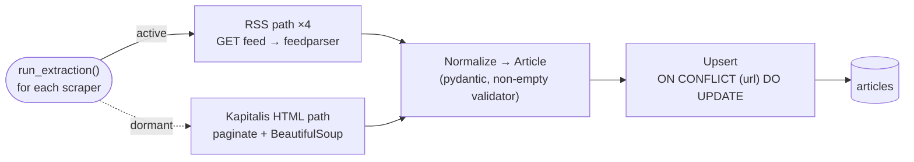

## 3.3 Two collection strategies

| Strategy | How | When it wins |
|---|---|---|
| **RSS feed** *(active)* | Parse each outlet's XML feed with `feedparser` | Fast, structured, low-bandwidth, polite by design |
| **HTML deep-crawl** *(dormant fallback)* | Paginate listing pages, parse each article with BeautifulSoup | When a source has no feed or a shallow one |

!!! insight "💡 Key insight — why RSS first"
    RSS is a **contract the publisher offers you**. It is structured, stable, and cheap. HTML scraping is *reverse-engineering a page that can change any day*. Preferring feeds and keeping HTML as a fallback minimises both fragility and load on the source.

## 3.4 The `BaseScraper` contract

Every scraper — RSS or HTML — implements the same interface, so the pipeline treats them uniformly:

```python
class BaseScraper:
    def scrape(self) -> list[Article]:
        """Return a list of validated Article objects. Never raise on a
        single bad item; skip it and keep going."""
```

!!! success "✅ Best practice — fail soft on individual items"
    One malformed article must never sink the whole run. Scrapers **skip and continue**, so a batch of 50 with 2 broken items still yields 48 good ones.

## 3.5 Politeness and safety

- **Polite delays** between requests, so the pipeline does not hammer a source.
- **Retries** on transient network errors.
- **A non-empty validator** on the `Article` model rejects blank titles/content.
- **Upsert on URL** guarantees the same article is never stored twice.

> ### ⚠️ Common mistakes
> - **No delay / no user-agent discipline** → you get rate-limited or IP-banned.
> - **Trusting the page structure** → a CSS change silently breaks extraction; always validate the output (non-empty title *and* content).
> - **Deduping on title** instead of a stable key (URL) → near-duplicate headlines collide or slip through.

> ### 🛠️ Practical example
> Mosaïque publishes the same wire story twice with slightly different timestamps but the same URL. The first insert creates the row; the second hits `ON CONFLICT (url)` and updates it in place. The corpus stays clean without any explicit "have I seen this?" bookkeeping.

> ### 🎯 Interview questions
> 1. Why prefer RSS over HTML scraping, and when would you *have* to scrape HTML?
> 2. What is the single most reliable deduplication key for news articles, and why not the title?
> 3. How do you make a scraper resilient to one source changing its markup?

> ### 🔬 Advanced notes
> The dormant HTML crawler is kept in the codebase (not deleted) because reactivating it is a config change, not a rewrite. In production you would add **conditional GETs** (`If-Modified-Since` / `ETag`) to skip unchanged feeds entirely, and a **per-source backoff** so one flaky outlet cannot slow the whole run.

---

# 4. Storage & data model

## 4.1 The core idea

> **One `articles` table holds everything**: identity, content, every enrichment signal, and a 384-dimensional vector — so that "find similar articles" is a SQL query, not a cross-system dance.

## 4.2 What is pgvector? (plain language first)

**pgvector** is a PostgreSQL extension that adds a `vector` column type and distance operators. In practice it means: *you can store an embedding next to a row and ask the database for the nearest rows by meaning, using ordinary SQL.*

```sql
-- "5 articles closest in meaning to this query vector"
SELECT id, title
FROM articles
ORDER BY embedding <=> :query_vector   -- <=> is cosine distance
LIMIT 5;
```

| Symbol | Meaning |
|---|---|
| `vector(384)` | A 384-number array — the article's "meaning fingerprint" |
| `<=>` | Cosine distance operator (smaller = more similar) |

## 4.3 The schema

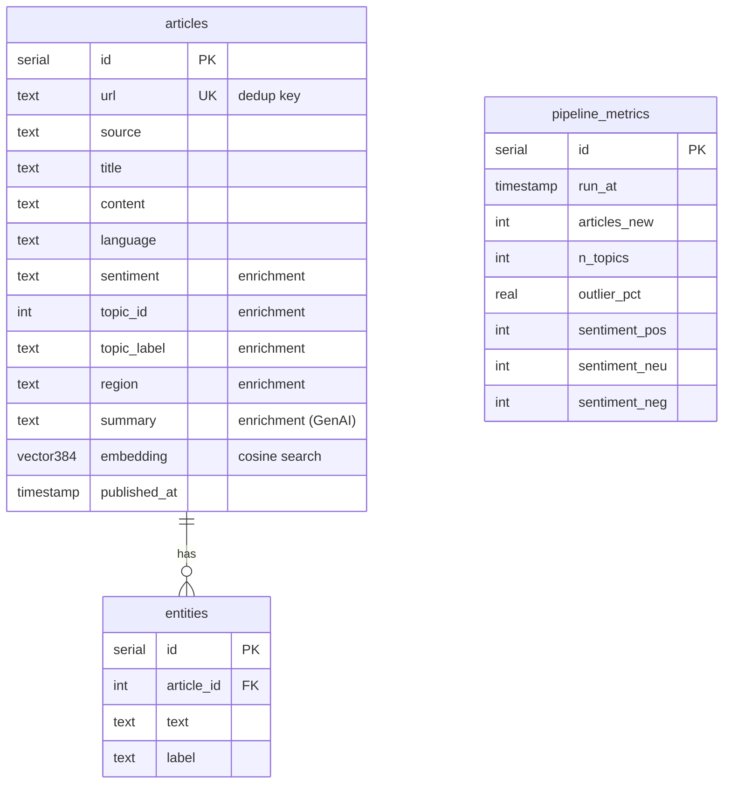

| Group | Columns | Filled by |
|---|---|---|
| **Identity** | `id`, `url`, `source`, `published_at` | Ingestion |
| **Content** | `title`, `content`, `language`, `image_url`, `categories[]` | Ingestion |
| **Enrichment** | `sentiment`, `topic_id`, `topic_label`, `region`, `summary` | ML + GenAI |
| **Vector** | `embedding vector(384)` | Embedding model |

## 4.4 pgvector vs a dedicated vector database

| | **pgvector (chosen)** | Dedicated ANN DB (Pinecone, Qdrant, Milvus) |
|---|---|---|
| Infra | Zero extra — it's just Postgres | A second system to run and sync |
| Transactions | Full ACID with your metadata | Eventual consistency across two stores |
| Scale ceiling | Millions comfortably (with an index) | Billions |
| Query model | SQL you already know | A separate API/DSL |
| Best for | *This* project's size | Massive, high-QPS retrieval |

!!! insight "💡 Key insight — right-sized retrieval"
    At this corpus size, an **exact** nearest-neighbour scan is fast enough and always accurate. Reaching for a specialised approximate-nearest-neighbour database would add operational cost to solve a problem the project does not have yet. *Match the tool to the scale.*

!!! tip "⚡ Quick tip — add the index before you grow"
    Exact scan is fine now, but the moment the table gets large, add an approximate index (`ivfflat` or `hnsw`) on the `embedding` column. It trades a sliver of recall for a big latency win.

> ### 📌 Key points
> - One flat table; enrichment is columns; the vector lives *in the row*.
> - `<=>` = cosine distance; `ORDER BY embedding <=> q LIMIT k` = semantic search.
> - pgvector was chosen because it needs **no extra infrastructure** and the corpus is small.

> ### ⚠️ Common mistakes
> - **Forgetting to normalise vectors** before cosine comparisons (the embedding step handles this — see Ch. 5).
> - **No vector index at scale** → every query becomes a full table scan.
> - **Mixing embedding models** in one column → distances become meaningless. All vectors must come from the *same* model.

> ### 🛠️ Practical example
> Semantic search for "football" returns articles about *matches, transfers, and clubs* even when the word "football" never appears — because their embeddings sit close to the query's embedding in vector space.

> ### 🎯 Interview questions
> 1. What does the `<=>` operator compute, and why cosine rather than Euclidean distance for text embeddings?
> 2. When would you migrate from pgvector to a dedicated vector database?
> 3. Why must all vectors in a column come from the same embedding model?

> ### 🔬 Advanced notes
> Cosine distance assumes **normalised** vectors; the e5 model outputs normalised embeddings, so cosine and dot-product rank identically. If you ever store un-normalised vectors, `<=>` and `<#>` (inner product) will disagree — a classic silent bug.

---

# 5. Machine learning & NLP enrichment

## 5.1 The mental model

Four models read each article and write one column each. Think of it as **an assembly line where every station stamps one piece of metadata.**

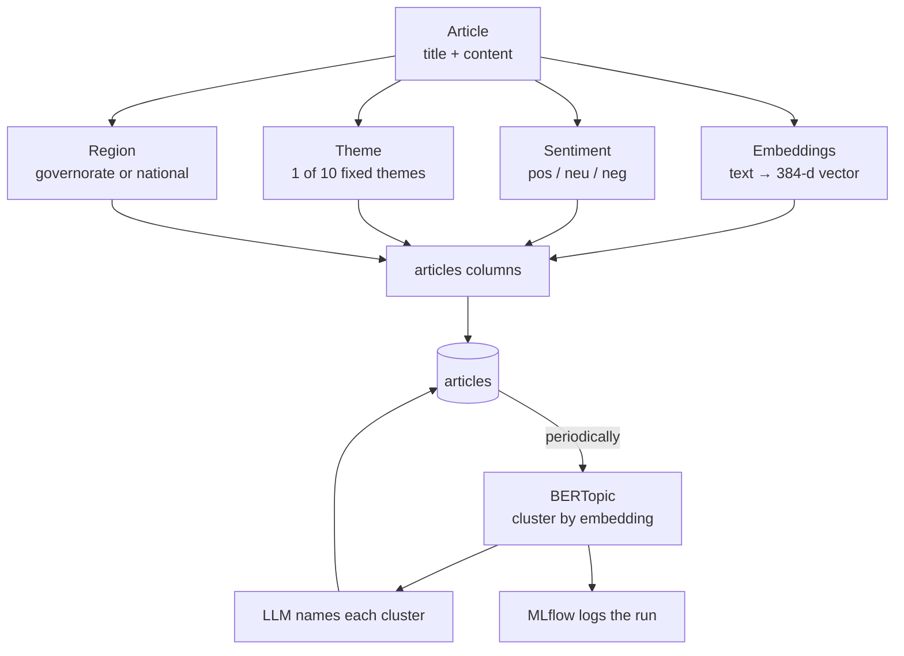

## 5.2 The four per-article signals

| Signal | Plain meaning | Model | Output |
|---|---|---|---|
| **Embedding** | A numeric fingerprint of the article's *meaning* | `intfloat/multilingual-e5-small` | `vector(384)` |
| **Sentiment** | Is the tone positive, neutral, or negative? | `cardiffnlp/twitter-xlm-roberta-base-sentiment` | one of 3 labels |
| **Theme** | Which of 10 editorial themes? | LLM (`classify_theme`) | `topic_label` + `topic_id` |
| **Region** | Which of 24 governorates (or national)? | Gazetteer + LLM fallback | `region` |

### 5.2.1 Embeddings — what and why

An **embedding** turns text into a list of numbers positioned so that *similar meanings are near each other.* It is the foundation of semantic search and of topic clustering.

!!! note "📌 Why multilingual e5-small"
    Tunisian news mixes **French and Arabic**. A multilingual model maps both languages into the *same* vector space, so a French and an Arabic article about the same event land near each other. `small` keeps inference cheap on CPU; the `passage:` prefix and normalisation follow the model's intended usage.

### 5.2.2 Sentiment — a Twitter-trained multilingual model

`cardiffnlp/twitter-xlm-roberta-base-sentiment` was trained on multilingual social-media text, which suits short, opinionated news snippets better than a formal-English-only model.

### 5.2.3 Topics — supervised *theme* vs unsupervised *topic*

This is a subtle but important distinction:

| | **Theme** (`classify_theme`) | **Topic** (BERTopic) |
|---|---|---|
| Nature | Supervised — pick 1 of 10 fixed labels | Unsupervised — discover clusters |
| Set of labels | Predefined, stable | Emerges from the data, changes over time |
| Runs | Per article | Periodically over the whole corpus |
| Good for | Consistent filtering ("Sport", "Économie") | Finding *what is actually being talked about* this week |

### 5.2.4 What is BERTopic?

**BERTopic** groups articles by their embeddings into clusters, then describes each cluster with its most distinctive words. It answers: *"Without me telling it the categories, what themes are in this corpus right now?"*

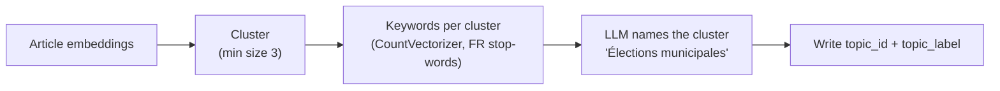

### 5.2.5 Region — gazetteer first, LLM as backup

A **gazetteer** is a dictionary of place names. `tag_region` first tries a fast dictionary match against the 24 governorates; only *ambiguous* cases fall back to an LLM.

!!! success "✅ Best practice — cheap-path-first"
    Do the **fast, deterministic thing first** (dictionary lookup) and only call the expensive, non-deterministic LLM when the cheap path is uncertain. It saves money, latency, and adds reproducibility for the common case.

## 5.3 Comparison: the enrichment models

| Model | Type | Cost | Deterministic? | Runs where |
|---|---|---|---|---|
| e5-small | Encoder | Low (CPU) | ✅ Yes | Local |
| XLM-RoBERTa | Classifier | Low (CPU) | ✅ Yes | Local |
| BERTopic | Clustering | Medium | ⚠️ Mostly | Local |
| `classify_theme` / `tag_region` | LLM | Higher (API) | ❌ No | Groq (external) |

> ### 📌 Key points
> - **Embeddings** power both semantic search *and* topic clustering.
> - **Theme** (supervised, fixed) and **Topic** (unsupervised, emergent) are different tools for different questions.
> - **Multilingual** models are non-negotiable for FR/AR content.
> - The gazetteer shows the **cheap-path-first** pattern.

> ### ⚠️ Common mistakes
> - **Comparing embeddings from different models** — meaningless distances.
> - **Treating BERTopic output as stable** — clusters shift as the corpus grows; that is a feature, not a bug, but downstream code must not assume fixed IDs.
> - **Calling an LLM for every region** when a dictionary would answer 90% of cases deterministically.

> ### 🛠️ Practical example
> Ten articles about a heatwave arrive. Individually they get `sentiment=negative`, `theme=Environnement`, `region` per city mentioned. On the next clustering pass, BERTopic groups them into one cluster; the LLM labels it *"Canicule et alertes météo"*, and every article's `topic_label` is updated.

> ### 🎯 Interview questions
> 1. Explain the difference between a supervised *theme* and an unsupervised *topic*. When do you want each?
> 2. Why is a multilingual embedding model essential for this corpus?
> 3. BERTopic cluster IDs change between runs — what does that imply for any feature that stores `topic_id`?
> 4. Describe the "cheap-path-first" pattern using `tag_region` as the example.

> ### 🔬 Advanced notes
> BERTopic's default pipeline is *embeddings → UMAP (dimensionality reduction) → HDBSCAN (density clustering) → c-TF-IDF (keywords)*. The `min_topic_size` guards against tiny, noisy clusters. Because UMAP/HDBSCAN are stochastic, topic IDs are **not stable across runs** — which is exactly why the run is logged to MLflow (Ch. 7) so you can reproduce a specific clustering.

---

# 6. Generative AI & retrieval-augmented generation (RAG)

## 6.1 The three GenAI features

| Feature | What the user sees | How it works |
|---|---|---|
| **Summaries** | A short abstract of a long article | LLM call, cached on the row |
| **Topic labels** | Human names for auto-found clusters | LLM names each BERTopic cluster |
| **Ask-the-news chat** | Ask a question, get a sourced answer | **RAG** (below) |

!!! success "✅ Best practice — provider-agnostic client"
    The LLM is reached through an **OpenAI-compatible** client (pointed at Groq by default). Swapping providers is a config change, not a code change — you are never locked to one vendor's SDK.

## 6.2 What is RAG? (and why it matters)

**Retrieval-Augmented Generation** means: *retrieve the relevant documents first, then let the LLM answer using only those.* The model does not answer from its training memory — it answers from *your* corpus.

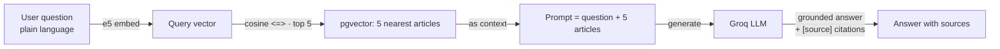

### Why RAG instead of a fine-tuned model?

| | **RAG (chosen)** | Fine-tuning |
|---|---|---|
| Freshness | Answers about *today's* articles instantly | Needs retraining to learn new content |
| Grounding | Cites the exact source articles | Can hallucinate confidently |
| Cost | One embedding + one prompt | Expensive training runs |
| Effort to update | Add articles to the DB | Re-train and re-deploy |
| Best for | A changing corpus you must cite | Stable style/format adaptation |

!!! insight "💡 Key insight — grounding beats memorising"
    The chat assistant is trustworthy **because it can only speak about the five articles it retrieved.** If the corpus does not contain an answer, it says so, and every claim links back to a source. That is the single most important property for a news tool: *no invented facts.*

## 6.3 AI-assisted search

Semantic search returns the nearest vectors; an optional LLM pass then **filters for genuine relevance** rather than padding the list to *k* results. Better to return 3 strong hits than 10 with filler.

> ### 📌 Key points
> - RAG = **retrieve, then generate** — answers come from the corpus, not the model's memory.
> - It gives **freshness + citations** without any retraining.
> - The LLM client is **provider-agnostic** (OpenAI-compatible → Groq).

> ### ⚠️ Common mistakes
> - **Skipping retrieval** and asking the LLM directly → confident hallucinations.
> - **Not citing sources** → users cannot verify, so they cannot trust.
> - **Prompt injection** — a malicious article could contain "ignore your instructions." Treat retrieved text as *data*, not commands.
> - **Un-cached summaries** → paying for the same summary on every page view.

> ### 🛠️ Practical example
> A user asks *"latest sports news?"*. The question is embedded, pgvector returns the 5 nearest articles, the LLM answers *"According to the provided articles, Rayed Derbali signed for Stade Tunisien [4]…"* and lists those five as clickable sources. Nothing outside the retrieved set is asserted.

> ### 🎯 Interview questions
> 1. Explain RAG in one sentence. What problem does it solve that a plain LLM call does not?
> 2. When is RAG the right choice and when would you fine-tune instead?
> 3. What is prompt injection in a RAG system and how do you defend against it?
> 4. Why cache summaries, and where is the cache here?

> ### 🔬 Advanced notes
> Retrieval quality caps answer quality: if the top-5 miss the relevant article, the LLM cannot recover. Production RAG adds **re-ranking** (a cross-encoder re-scores the top-k), **query rewriting**, and **guardrails** that strip instruction-like text from retrieved passages before they reach the prompt.

---

# 7. Orchestration & MLOps

> This is the chapter that turns "some models" into "a platform." It is also the chapter reviewers should read most closely, because it is what the word *MLOps* in the title actually refers to.

## 7.1 What is MLOps? (definition first)

**MLOps** is the set of practices that keep a machine-learning system **running reliably in production**: automating the pipeline, tracking experiments, monitoring behaviour, and making everything reproducible. It is *DevOps for ML*, plus the extra headaches that data and models bring.

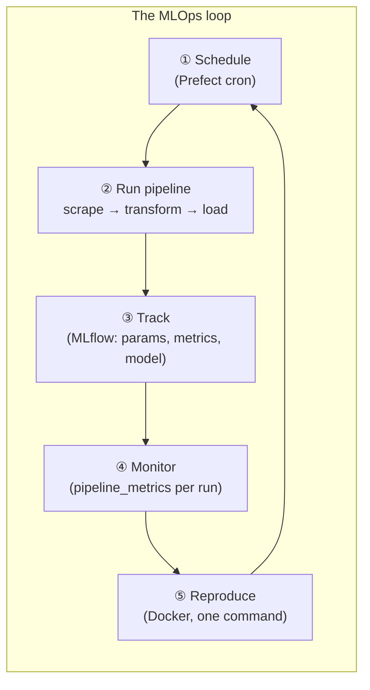

## 7.2 The four MLOps pillars in News Insight

| Pillar | Tool | What it gives you |
|---|---|---|
| **Orchestration** | Prefect | The pipeline runs itself, retries on failure, and can be triggered on demand |
| **Experiment tracking** | MLflow | Every clustering run's parameters, metrics, and fitted model are recorded |
| **Monitoring** | `pipeline_metrics` table | A per-run health record you can query and chart |
| **Reproducibility** | Docker Compose | The whole stack rebuilds identically with one command |

### 7.2.1 Orchestration — Prefect

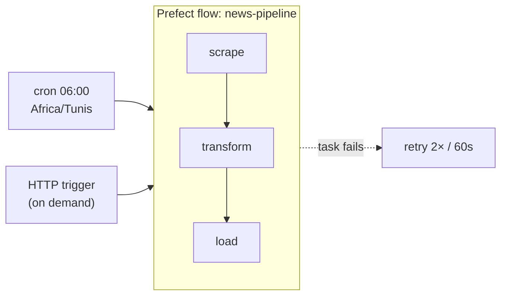

- **Schedule:** a daily cron at 06:00 Africa/Tunis, *or* an on-demand HTTP trigger.
- **Retries:** each task retries twice with a 60-second gap, so a transient network blip self-heals.
- **Idempotent:** because writes are upserts, a retried task cannot corrupt data.

### 7.2.2 Experiment tracking — MLflow

The clustering step (BERTopic) is **non-deterministic**, so each run is logged:

| Logged | Example |
|---|---|
| **Params** | `embed_model = e5-small`, `min_cluster_size = 3` |
| **Metrics** | `n_topics`, `outlier_pct` |
| **Artifact** | the fitted `bertopic_model` (versioned) |

!!! insight "💡 Key insight — track the non-deterministic parts"
    You do not need to track everything. You need to track **what you cannot otherwise reproduce.** Deterministic steps (embedding a fixed text) always give the same output; a stochastic clustering does not — so *that* is what MLflow records, letting you rebuild or compare any run.

### 7.2.3 Monitoring — `pipeline_metrics`

Every run appends one row: how many articles came in, how many topics were found, the outlier percentage, and the sentiment split.

```sql
-- "Is the pipeline healthy over the last 14 runs?"
SELECT run_at, articles_new, n_topics, outlier_pct
FROM pipeline_metrics
ORDER BY run_at DESC
LIMIT 14;
```

!!! tip "⚡ Quick tip — monitoring is just a table you write to"
    You do not need a fancy observability stack to start. A single **append-only metrics table** turns "is it working?" into a SQL query and a chart. Sudden drops in `articles_new` or spikes in `outlier_pct` are your earliest warning signs.

### 7.2.4 Reproducibility — Docker

One `docker-compose up` starts every service on one network (see Ch. 10). Any machine with Docker gets the identical stack — no "works on my laptop."

## 7.3 An MLOps maturity check

| Capability | Status | Note |
|---|---|---|
| Automated pipeline | ✅ | Prefect flow, scheduled + triggerable |
| Idempotent / safe re-runs | ✅ | Upsert everywhere |
| Experiment tracking | ✅ | MLflow for clustering |
| Run monitoring | ✅ | `pipeline_metrics` |
| One-command reproducibility | ✅ | Docker Compose |
| Automated tests / CI | ⚠️ | Room to grow |
| Data/model drift detection | ⚠️ | Future work |
| Model registry + promotion | ⚠️ | MLflow artifact exists; formal promotion not yet |

> ### 📌 Key points
> - MLOps here = **orchestration + tracking + monitoring + reproducibility.**
> - Prefect makes the pipeline **self-running and self-healing**; upsert makes retries safe.
> - MLflow tracks the **non-deterministic** clustering so it is reproducible.
> - `pipeline_metrics` is monitoring you can **query with SQL**.

> ### ⚠️ Common mistakes
> - **A pipeline that only runs by hand** — not automated, not reproducible.
> - **Not tracking stochastic steps** — you can never explain or reproduce a past result.
> - **No monitoring** — the first sign of breakage is a user complaint, not an alert.
> - **Retries without idempotency** — self-healing that self-corrupts.

> ### 🛠️ Practical example
> At 06:00 the cron fires. `scrape` pulls 12 new articles; a transient timeout fails `transform`, which retries and succeeds. Clustering runs, MLflow logs `n_topics=7, outlier_pct=0.18` and saves the model. One row lands in `pipeline_metrics`. A week later you notice `outlier_pct` creeping up and investigate — monitoring did its job.

> ### 🎯 Interview questions
> 1. Define MLOps and name its pillars as implemented here.
> 2. Why does the pipeline log clustering to MLflow but *not* the embedding step?
> 3. How do retries and idempotency work together to make the pipeline safe?
> 4. What would you monitor to catch data drift, and where would that live?

> ### 🔬 Advanced notes
> The natural next steps up the maturity curve: a **persistent Prefect worker** (so the cron truly runs unattended), a **model registry with stage promotion** (Staging → Production), and **drift detection** comparing this run's embedding/sentiment distribution against a rolling baseline — alerting when the corpus's character shifts.

---

# 8. Backend API (FastAPI)

## 8.1 Role

The API is the **only door** to the data. The pipeline writes; the API reads (and triggers). This separation means the UI never talks to the database directly.

## 8.2 The five routers

| Router | Responsibility |
|---|---|
| `articles` | List, filter, and fetch articles |
| `search` | Semantic + AI-assisted search |
| `genai` | Summaries and the RAG chat endpoint |
| `img` | Image proxying for article thumbnails |
| `pipeline` | Trigger and inspect pipeline runs |

## 8.3 Design choices

!!! success "✅ Best practice — hand-written parameterised SQL"
    The backend uses **parameterised SQL**, not an ORM. For a read-heavy app with a handful of tables, this keeps queries explicit and fast, and — critically — parameters prevent SQL injection.

!!! warning "🚧 Warning — the pipeline endpoints are unauthenticated"
    The `pipeline` router can trigger runs. Today it has **no authentication** — acceptable for a local demo, a real gap for production. (Listed honestly in Future Work.)

> ### 📌 Key points
> - Five routers; the API is the sole data access layer.
> - **Parameterised SQL, no ORM** — explicit and injection-safe.
> - FastAPI gives typed request/response models and free interactive docs.

> ### ⚠️ Common mistakes
> - **String-building SQL** instead of parameters → SQL injection.
> - **Letting the frontend hit the DB** directly → no validation boundary.
> - **Unauthenticated mutating endpoints** exposed to the internet.

> ### 🛠️ Practical example
> The UI calls `GET /search?q=football`. The `search` router embeds the query, runs the pgvector nearest-neighbour SQL with the vector as a bound parameter, optionally LLM-filters, and returns typed JSON the frontend renders.

> ### 🎯 Interview questions
> 1. Why parameterised SQL over an ORM here, and what security property do parameters give?
> 2. Why should the frontend never query the database directly?
> 3. How would you add authentication to the pipeline endpoints without breaking the read API?

> ### 🔬 Advanced notes
> FastAPI's dependency-injection system is the clean place to add cross-cutting concerns: an `auth` dependency on the `pipeline` router, rate-limiting on `search`, and response caching on `genai` summaries — each without touching business logic.

---

# 9. Frontend (React + Vite)

## 9.1 What the user actually touches

| Page | Purpose | Notable tech |
|---|---|---|
| **À la une (home)** | Hero + latest feed, tagged by topic & mood | React |
| **Analyses (dashboard)** | Sentiment donut, top-themes bar, 30-day trend | `recharts` |
| **Carte (map)** | 24 governorates shaded by volume/sentiment | `d3-geo` |
| **Recherche (search)** | Semantic search results | — |
| **Assistant IA (chat)** | RAG chat widget with citations | — |

## 9.2 Why these visualisations

!!! insight "💡 Key insight — the UI is where enrichment pays off"
    Every column the pipeline writes becomes something a non-technical user can *see*: sentiment → a donut, topics → a bar chart, region → a choropleth map, embeddings → search results. **The value of the ML is only realised at the glass.**

> ### 📌 Key points
> - React + Vite SPA; `recharts` for charts, `d3-geo` for the Tunisia map.
> - Each enrichment signal maps to a specific visualisation.
> - The chat widget surfaces RAG answers *with* their sources.

> ### ⚠️ Common mistakes
> - **Charting raw counts** without normalising → misleading comparisons.
> - **Blocking render on slow LLM calls** → freeze the UI; stream or show a loading state.

> ### 🛠️ Practical example
> The dashboard's donut reads the sentiment split straight from aggregated `articles` rows: 27% positive, 28% neutral, 45% negative — a one-glance mood of the news.

> ### 🎯 Interview questions
> 1. Map each enrichment column to the visualisation that consumes it.
> 2. How would you keep the chat UI responsive while the LLM is thinking?

> ### 🔬 Advanced notes
> The map uses `d3-geo` with a GeoJSON of Tunisia's governorates; each region's fill is a scale over the aggregated metric. Pre-aggregating those metrics in SQL (rather than in the browser) keeps the payload small and the render fast.

---

# 10. Deployment & operations

## 10.1 One command, five services

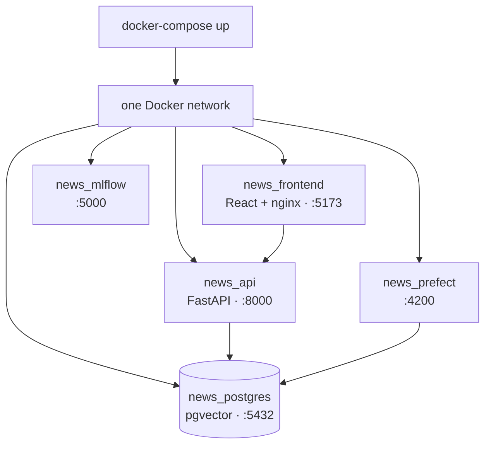

| Service | Image role | Port |
|---|---|---|
| `news_postgres` | Database (pgvector) | 5432 |
| `news_api` | FastAPI backend | 8000 |
| `news_frontend` | React build behind nginx | 5173 |
| `news_prefect` | Orchestration server | 4200 |
| `news_mlflow` | Tracking server | 5000 |

!!! success "✅ Best practice — the environment is code"
    The stack is defined in `docker-compose.yml` and configured via environment variables. "How do I run it?" has a one-line answer, and every teammate — and every CI machine — gets the identical setup.

> ### 📌 Key points
> - Five containers, one network, one command.
> - Config via env vars; secrets (LLM keys) never hard-coded.
> - Reproducible on any Docker host.

> ### ⚠️ Common mistakes
> - **Hard-coding secrets** in the image or compose file.
> - **No health checks / start-order** → the API races the database on boot.
> - **Baking data into images** → images balloon and lose reproducibility.

> ### 🛠️ Practical example
> A reviewer clones the repo, sets an LLM key in `.env`, runs `docker-compose up`, and has the full platform — database, API, UI, Prefect, MLflow — on `localhost` minutes later.

> ### 🎯 Interview questions
> 1. What does "the environment is code" buy you over a README of manual steps?
> 2. How do you handle service start-order (API needs the DB) in Compose?
> 3. Where do secrets live, and where must they *never* live?

> ### 🔬 Advanced notes
> The next step is a **persistent Prefect worker** container so scheduled runs happen without a human, plus **health checks** and `depends_on: condition: service_healthy` so boot order is deterministic. Beyond a single host, this compose file becomes a set of Kubernetes manifests or a managed-services diagram.

---

# 11. Results & contributions

## 11.1 What the project demonstrates

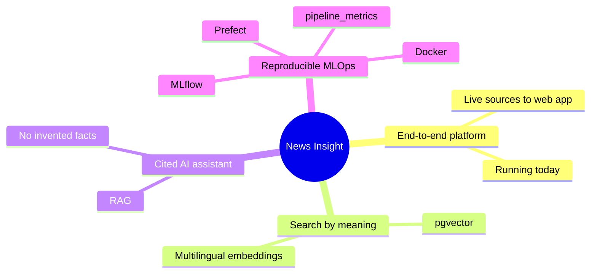

| Contribution | Evidence |
|---|---|
| **A complete end-to-end platform** | Live news sites → searchable, answerable app, running today |
| **Search by meaning** | pgvector + multilingual embeddings over FR/AR text |
| **An assistant that cites its sources** | RAG grounded in the corpus; nothing invented |
| **Reproducible MLOps** | Scheduled, tracked, monitored; one-command deploy |

## 11.2 Honest limitations

!!! warning "🚧 Current limits (and why they're acceptable for scope)"
    - **Four sources, French-first** — enough to prove the pipeline; more is mechanical, not conceptual.
    - **No permanent Prefect worker** — the cron is defined but needs a running worker to fire unattended.
    - **No auth on pipeline endpoints** — fine locally, not for the open internet.
    - **Arabic dialect** handling is shallow — the models are multilingual but not dialect-tuned.

---

# 12. Key takeaways & recommendations

## 12.1 The five things to remember

1. **"Columns not services."** Storing enrichment as columns on one table, with upserts, is what makes the pipeline simple and safe to re-run.
2. **Match the tool to the scale.** pgvector (not a dedicated vector DB) is the right call at this size — and the guide says exactly when that flips.
3. **RAG buys trust.** Grounding answers in retrieved articles, with citations, is the single most important property for a news assistant.
4. **Track the non-deterministic parts.** MLflow records clustering because that is what you cannot otherwise reproduce.
5. **MLOps is the deliverable.** Orchestration + tracking + monitoring + reproducibility is what makes this a *platform*, not a notebook.

## 12.2 Actionable recommendations

| Priority | Recommendation | Why |
|---|---|---|
| 🔴 High | Run a **persistent Prefect worker** | Makes the schedule real, unattended |
| 🔴 High | **Authenticate** the pipeline/mutating endpoints | Close the obvious production gap |
| 🟠 Medium | Add a **vector index** (`hnsw`) before scaling | Keeps search fast as the corpus grows |
| 🟠 Medium | Add **drift monitoring** on sentiment/topic distributions | Catch corpus shifts early |
| 🟢 Later | Introduce a **model registry with promotion** | Formalise Staging → Production |
| 🟢 Later | Expand **sources + Arabic-dialect** models | Broaden coverage and accuracy |

## 12.3 A production-readiness checklist

- [x] Automated, scheduled pipeline
- [x] Idempotent, safe re-runs
- [x] Experiment tracking
- [x] Per-run monitoring
- [x] One-command reproducible deploy
- [ ] Persistent scheduler/worker
- [ ] AuthN/AuthZ on mutating endpoints
- [ ] Vector index at scale
- [ ] Drift detection & alerting
- [ ] Automated tests + CI

---

# Appendix A — Glossary

| Term | Plain-language meaning |
|---|---|
| **Embedding** | A list of numbers representing a text's meaning; similar meanings sit close together |
| **pgvector** | Postgres extension that stores vectors and finds nearest ones with SQL |
| **Cosine distance (`<=>`)** | A measure of how different two vectors' directions are; smaller = more similar |
| **Sentiment analysis** | Deciding whether text is positive, neutral, or negative |
| **BERTopic** | A method that clusters documents by embedding and names each cluster |
| **Gazetteer** | A dictionary of place names used to tag locations |
| **RAG** | Retrieve relevant documents, then let an LLM answer using only those |
| **LLM** | Large Language Model — the text-generation model behind summaries and chat |
| **Orchestration** | Automatically running pipeline steps in order, on a schedule, with retries |
| **Idempotent** | Running an operation twice has the same effect as running it once |
| **MLflow** | A tool that records ML experiment parameters, metrics, and models |
| **MLOps** | Practices for running ML systems reliably in production |
| **Prefect** | A Python orchestration tool for scheduling and running workflows |
| **Upsert** | Insert if new, update if it already exists (`ON CONFLICT`) |

# Appendix B — Technology reference

| Layer | Technology | Why it's here |
|---|---|---|
| Language | Python | Ecosystem for data/ML |
| Database | PostgreSQL + pgvector | Metadata *and* vectors in one place |
| Embeddings | `intfloat/multilingual-e5-small` | FR/AR meaning vectors, CPU-friendly |
| Sentiment | `cardiffnlp/twitter-xlm-roberta-base-sentiment` | Multilingual, social-text-tuned |
| Topics | BERTopic | Unsupervised topic discovery |
| LLM | OpenAI-compatible (Groq) | Summaries, labels, RAG; provider-agnostic |
| Orchestration | Prefect | Scheduling, retries, triggers |
| Tracking | MLflow | Reproducible clustering runs |
| Backend | FastAPI | Typed, fast, auto-documented API |
| Frontend | React + Vite | SPA with charts and a map |
| Deploy | Docker Compose | One-command reproducible stack |

# Appendix C — An article's life (end to end)

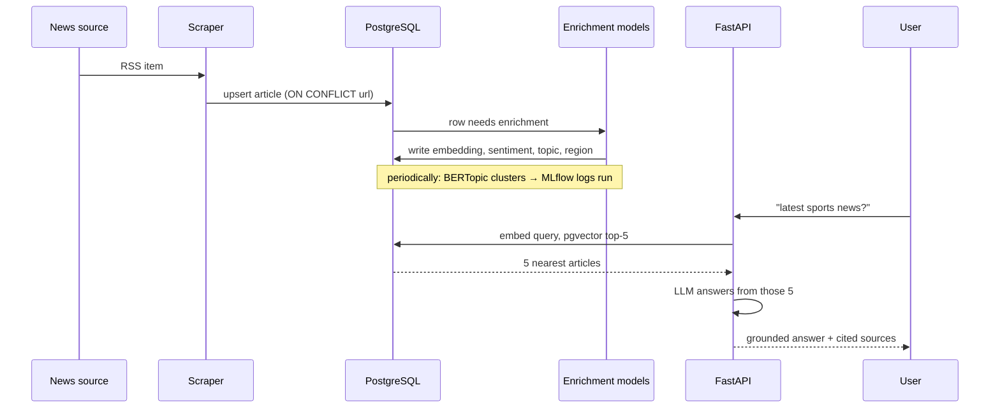

---

> **Final word.** News Insight is small in corpus but complete in shape: it collects, understands, and serves Tunisian news through one automated, tracked, reproducible pipeline. The models are off-the-shelf; the *system* around them — the columns-not-services data model, the idempotent pipeline, the grounded RAG assistant, the MLflow-tracked clustering, the one-command deploy — is the real contribution. That system is what the word *MLOps* in the title stands for.
